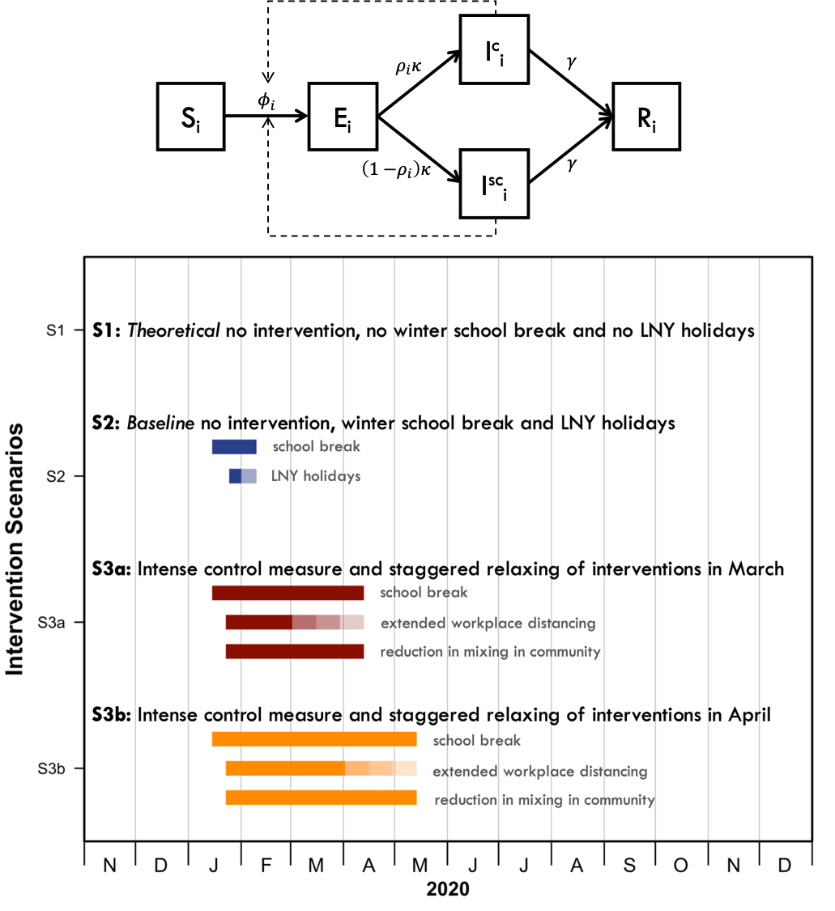
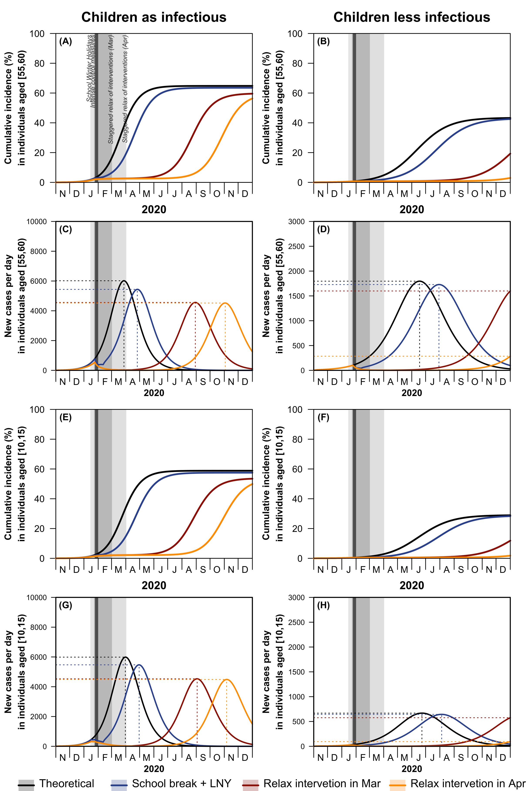
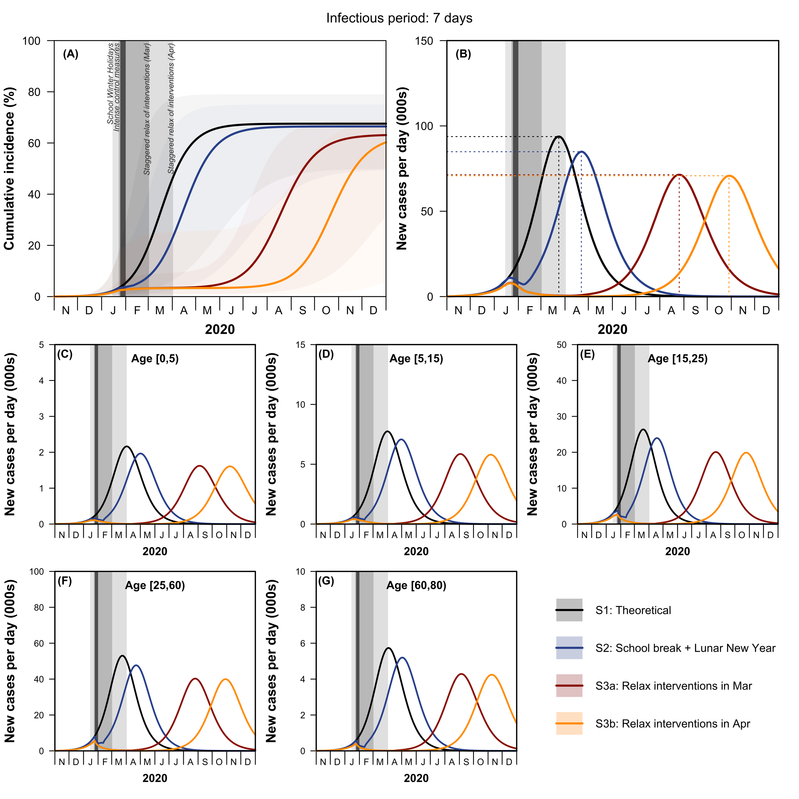

```{r setup, include=FALSE}
knitr::opts_chunk$set(echo = FALSE)
``` 

```{r settings}
## Report date
target_date <- Sys.Date() - 1
```

*Contributors: Kiesha Prem <sup>†</sup>, Yang Liu <sup>†</sup>, Timothy W Russell, Adam J Kucharski, Rosalind M Eggo, Nicholas Davies, Centre for the Mathematical Modelling of Infectious Diseases COVID-19 Working Group, Mark Jit, Petra Klepac*
  
  *Correspondence to: kiesha.prem@lshtm.ac.uk* 
  
  *<sup>†</sup> authors contributed equally* 
  
  *The full paper accompanying this report can be found as a preprint [here:](https://www.medrxiv.org/content/10.1101/2020.03.09.20033050v1)*


## Aim

To assess the impact of a range of control measures that reduce social mixing on data from the COVID-19 outbreak in Wuhan, China. Using the best estimates for the epidemiological parameters, we simulate the effects of the control measures using an age-structured, location-specific transmission model. The model uses data on contact patterns. Specifically, we adjust these patterns according to how they change under certain control measures. We then simulate our transmission model under these different scenarios and assess the impact.

## Introduction

The SARS-CoV-2, a novel coronavirus, emerged in the City of Wuhan, Hubei Province, China, in early December 2019.(1,2) Since then, the local and national governments have taken unprecedented measures in response to the COVID-19 outbreak caused by SARS-CoV-2.(3) Exit screening of passengers was shortly followed by travel restrictions in Wuhan on 23rd January 2020, halting all means of unauthorised travel into and out of the city. Similar control measures were extended to the entire province of Hubei by 26th January 2020.(3) Non-pharmaceutical social distancing interventions such as extended school closure and workplace distancing were introduced to reduce the impact of the COVID-19 outbreak in Wuhan.(4) Within the city, schools remained closed; Lunar New Year holidays were extended so that people stayed away from their workplaces; the local government promoted social distancing and encouraged residents to avoid crowded places. These measures are known to have greatly changed the age-specific mixing patterns within the population in previous outbreak response efforts for other respiratory infectious diseases.(5,6) While travel restrictions undoubtedly had a role in reducing the exportations of infections outside of Wuhan, and delayed the onset of outbreaks in other regions,(7,8) changes in the mixing patterns affected the trajectory of the outbreak within Wuhan itself. In order to estimate the effects of social distancing measures on the progression of the COVID-19 epidemic, we look at Wuhan, hoping to provide some insights for the rest of the world.

To examine how these changes in population mixing have affected the outbreak progression in Wuhan, we used synthetic location-specific contact patterns in Wuhan and adapted it in the presence of school closures, extended workplace closures, reduction in mixing in the general community. Using these matrices and the latest estimates of the epidemiological parameters of the Wuhan outbreak,(1,9,14–16) we simulated the ongoing trajectory of an outbreak in Wuhan using an age-structured susceptible-exposed-infected-removed (SEIR) model(17,18) for several social distancing measures. 

## Methods

### SEIR Model

We simulated the outbreak in Wuhan using a deterministic stage-structured SEIR model over one year period, during which the modelled outbreak peters out. An implication of this approach is that all demographic changes in the population (i.e., births, deaths, and ageing) are ignored.

For a given age group , epidemic transitions can be described by:

$$ S_{i, t+1} = S_{i, t} - \beta S_{i, t} \sum_{j = 1}^n C_{i, j} I_{j, t}^c - \alpha \beta S_{i, t} \sum_{j = 1}^n C_{i, j} I_{j, t}^{SC} $$

$$ E_{i, t+1} = \beta \sum_{j = 1}^n C_{i, j} I_{j, t}^C + \alpha \beta S_{i, t} \sum_{j = 1}^n C_{i, j} I_{j, t}^{SC} - (1 - \kappa) E_{i, t}$$

$$ I_{i, t+1}^C = \rho_i \kappa E_{i, t} + (1 - \gamma)I_{j, t}^C$$

$$ I_{j, t+1}^{SC} = (1 - \rho_i) \kappa E_{i, t} + (1 - \gamma)I_{j, t}^C$$

$$ R_{i, t+1} = R_{i, t} + \gamma I_{j, t + 1}^C + \gamma I_{j, t + 1}^{SC} $$

Where $\beta$ is the transmission rate (scaled to the right value of $R_0$), $C_{i,j}$ describe the contacts of age group $j$ made by age group $i$, $\kappa = 1 - \exp(\frac{1}{d_L})$ is the daily probability of exposed individual becoming infectious (with $d_t$ being the average incubation period), and $\gamma = 1 - \exp(\frac{1}{d_I})$ is the daily probability that an infected individual recovers when the average duration of infection is $D_I$. We further incorporated contributions of asymptomatic and subclinical cases, $1 - \rho$ denotes the probability of an infected cases being asymptomatic or subclinical. We assumed that younger individuals are more likely to be asymptomatic (or subclinical) and less infectious (proportion of infectiousness compared to $I^C, \alpha$ ).


| Parameter | Values | References | 
|-----------|--------|------------|
| Basic reproduction number, $R_o$ | 2·2 (1·6–3·0) <sup>1</sup> | Kucharski and colleagues <sup>1, 4</sup> |
| Average incubation period, $d_L$ | 6·4 days | Backer and colleagues <sup>1,5</sup> |
| Average duration of infection, $d_I$ | 3 or 7 days | Woelfel and colleagues<sup>22</sup>|
| Initial number of infected, $I_O$ |200 or 2000 |Abbott and colleagues <sup>16</sup> |
|Pr(infected case is clinical), $\rho_i$ |0 or 0·4, for | Bi and colleagues<sup>20</sup> |
|                               |0 or 0·8  for | Davies and colleagues<sup>21</sup> |
|Pr(infection acquired from subclinical), $\alpha$ | 0·25 | Liu and colleagues <sup>19</sup> | 


```{r fig_1, fig.align='center', fig.cap="_**Figure 1. Age-structured SEIR model and details of the modelled social distancing interventions.** The age-specific mixing patterns of individuals in age group  alter their likelihood of being exposed to the virus given a certain number of infectives in the population. Younger individuals are more likely to be asymptomatic and less infectious, i.e. subclinical (SC). When $\\rho_i = 0$ for all $i$, the model simplifies to a standard SEIR. The force of infection $\\phi_{i, t}$ is given by $1 - (\\beta \\sum_j C_{i,j} I_{j,t}^C  + \\alpha \\beta \\sum_j C_{i,j} I_{j, t}^{SC})$_", out.width = '80%'}

```

## Results

Our simulations show that the control measures aimed at reducing the social mixing in the population can be effective in reducing the magnitude and delaying the peak of the outbreak. Figure 3 shows the effects of different control measures among individuals aged 55–60 and 10–15 years old. The standard school winter break and holidays for the Lunar New Year would have had little effect on progression of the outbreak had the school and workplace re-opened as normal.

```{r fig_3, echo=FALSE, fig.align='center', fig.cap="_**Figure 3. Effects of different intervention strategies on the cumulative incidence and new cases per day among individuals aged 55–60 (A to D) and 10–15 (E to H) from late 2019 to end-2020.** Under two scenarios children being equally infectious and children being less infectious, the effects of social distancing measures were investigated. Theoretical no intervention (black line), school break and LNY (blue line) and intense control measures that are relaxed in a staggered fashion at the beginning of March (red line), and intense control measures that are relaxed in a staggered fashion at the beginning of April (orange line). Shading indicates the timing of the school holidays, Lunar New Year (dark vertical line), intense control measures (dark grey), and staggered return to work followed by school opening (lighter grey)._", out.width = '80%'}

```

We presented the median cumulative incidence (Fig 4A), incident case per day (Fig 4B) and age-specific incidence per day (Fig 4C–G) of the 200 simulated outbreaks. The 25th and 75th percentile outbreaks are represented by the shaded area in the cumulative incidence. The intense control measures of prolonged school closure and work holidays reduced the final size (Fig 4A) and peak incidence, while also delaying the peak of the outbreak (Fig 4B). Our model suggests that the effects of these social distancing strategies vary across age categories, the reduction in incidence is highest among school children and older individuals and lowest among working-aged adults (Fig 4C–G and Fig 5). 


```{r fig_4, echo=FALSE, fig.align='center', fig.cap="_**Figure 4. Effects of the different social distancing measures on the cumulative incidence (A) and new cases per day (B), and age-specific incidence per day (C to G) from late 2019 to end-2020.** The median cumulative incidence, incident cases per day and age-specific incidence per day are represented as solid lines. The 25th and 75th percentile outbreaks are represented by the shaded area in the cumulative incidence. Theoretical no intervention (black line), school break and Lunar New Year (blue line) and intense control measures that are relaxed in a staggered fashion at the beginning of March (red line), and intense control measured that are relaxed in a staggered fashion at the beginning of April (orange line). Shading indicates the timing of the school holidays, Lunar New Year weekend (dark vertical line), intense control measures (dark grey), and staggered return to work followed by school opening (lighter grey)._", out.width = '80%'}

```

These measures were most effective if staggered return to work was at the beginning of April; this reduced the median number of infections by more than 92% (interquartile range: 66–97%) and 24% (interquartile range: 13–90%) in mid-2020 and end-2020, respectively, (Fig 5 and Fig S4) should the disease have a longer duration of infectiousness, and reduced the magnitude and delayed the peak incidence across all age categories (Fig 4C–E) which can have further beneficial impact by relieving the pressure on the healthcare system in the immediate few months. Uncertainty in $R_o$ values has a large impact on the timing of the peak and the final size of the outbreak (Fig 4A).

## Discussion

This study describes a mathematical model that quantifies the potential impacts of social distancing policies, relying on Wuhan as a case study. Epidemiological investigations conducted during the WHO-China Joint Mission on COVID-19 found many infections clustered around the households.(35) Extreme social distancing measures, including school closures, workplace closures, and avoiding any public gatherings all at once, can push the transmission to households leading to increased clustering in household cases.(5) As households are not explicitly included in the model, we do not consider heterogeneity and clustering of household transmission. Distinguishing between repeated and new contacts is important for disease propagation in contact network models,(36,37) more sophisticated methods accounting for temporal presence within the household(38) would be needed to characterise higher degrees of contact. Our compartmental model does not capture individual-level heterogeneity in contacts, which could be important in super-spreading events, particularly early on in an epidemic. In combination with nosocomial infections, the risk of COVID-19 infections is potentially amplified in close contacts of confirmed cases and healthcare workers. However, the compartmental model we presented is not equipped to explicitly consider transmission within health care institutions and households. More complex models, such as individual-based models with familial and healthcare structures, should be explored. Further research on the nosocomial infection risks among healthcare workers and patients have been identified as one of the research gaps to be prioritised in the next few months by the WHO.  

While the precise estimates of the impact of interventions may vary by country and indeed different estimates of key parameters, our model highlights the usefulness of social distancing interventions as well as the need to carefully calibrate their lifting to avoid second and subsequent waves of a COVID-19 epidemic. Non-Hubei China, and other east or southeast Asian regions have managed to avert a major outbreak locally and delayed the peak without resorting to Hubei’s extreme measures.(39) Policymakers are advised to reapportion their resources to focus on mitigating the impact of their potentially soon-do-be overwhelmed health system.(40)


## References

For cited articles and referenced figures (other than Figures 1, 3 and 4 which appear here, please see the preprint of the accepted paper [here:](https://www.medrxiv.org/content/10.1101/2020.03.09.20033050v1))